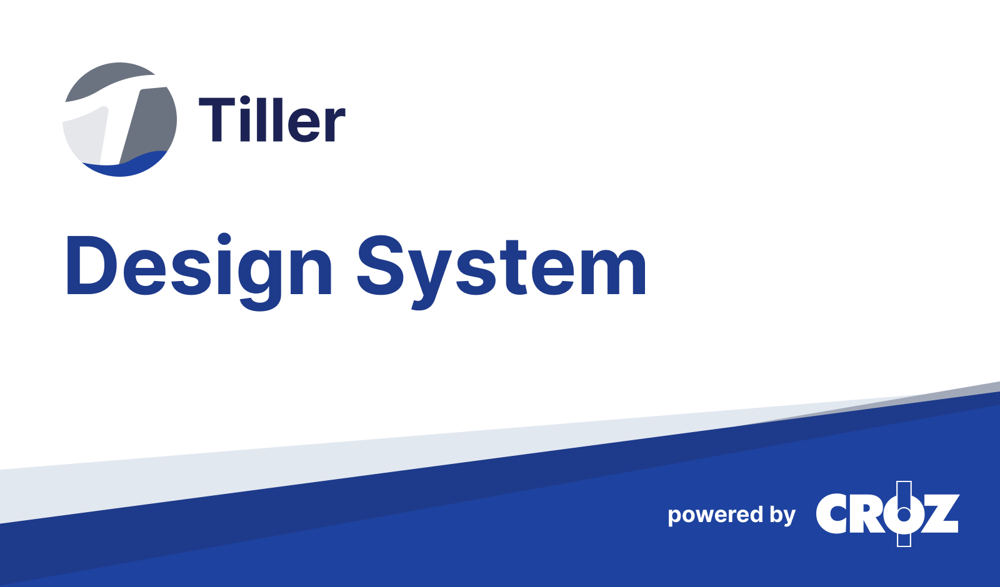

 Tiller Design System

---

[//]: # (//TODO: fix URLs )



## <h1 align="center">Tiller Design System</h1>

<p align="center">
<a href="https://github.com/croz-ltd/tiller/blob/master/LICENSE">
    
  </a>
  <a href="https://github.com/croz-ltd/tiller/actions/workflows/build.yml">
    
  </a>
  <a href="https://github.com/croz-ltd/tiller/blob/master/CONTRIBUTING.md">
    
  </a>
</p>

> A design system is a set of standards to manage design at scale by reducing redundancy while creating a shared language and visual consistency across different pages and channels.

**Tiller Design System** is open-source UI library which offers a set of visual, functional components and patterns that accelerate design and development. Components are endlessly customizable, accessible, and can integrate into any application with primarily focus on back-office applications. <br>
Tiller design system is based on **Tailwind UI/CS, Formik** and **ReachUI**. Besides these, Tiller is made with the help of **Nx, Yarn 2, Storybook** and **Codemod**.

| Package Name                                                                       | Version                                                          |
|------------------------------------------------------------------------------------|------------------------------------------------------------------|
| [@tiller-ds](https://www.npmjs.com/package/@tiller-ds/core)                        |           |
| [@tiller-ds/cra-template](https://www.npmjs.com/package/@tiller-ds/cra-template)   |   |
| [@tiller-ds/vite-template](https://www.npmjs.com/package/@tiller-ds/vite-template) |  |

## ✨ Features

- 📦 A set of high-quality React components out of the box
- 🛡 Written in TypeScript with predictable static types
- 🌐 Internationalization support
- 🎨 Powerful theme customization in every detail
- 🗃️ Storybook (Docs, Controls, Playroom)
- 📌 Rich Text Editor
- 📌 Login Pattern

## 📚 Documentation

- http://tiller-storybook-development.tos-cloud.lan.croz.net/

## 🚀 Getting Started

### Installation with [Create React App](https://reactjs.org/docs/create-a-new-react-app.html)

1. Install node.js
2. Install yarn
3. Create project with 
   ```
   yarn create react-app app-name --template @tiller-ds/cra-template
   ```
4. Run `yarn start` command to start your project

### Installation with [Vite](https://vitejs.dev/)

1. Install node.js
2. Install yarn
3. Create project with
   ```
   npx degit croz-ltd/tiller-vite
   ```
4. Run `yarn run` command to start your project

### Installation with custom project setup

If you use your own starter, basic steps needed for Tiller to work are next:

1. Dependency to `@tiller-ds/theme` and other wanted modules for your app
2. `tailwind.config.js` with this minimal config:

```
module.exports = {
  presets: [require('@tiller-ds/theme').preset]
};
```

3. Import of tiller styles in your main css file:

```
@import "@tiller-ds/theme/styles/tiller.css";
```

### Usage

Install packages you’re interested in using, for example, a @tiller-ds/core:
```
npm i @tiller-ds/core
```

```
import { Button } from "@tiller-ds/core";

<Button>Hello world!</Button>
```

### Styles

Tiller DS is bundled with a default theme that you can customize to match the look and feel of your project.

Customizations on theme level are implemented using design tokens which we call Tiller tokens.
For guides on Tiller tokens, head on over to our Storybook - [Theming and Customization](http://tiller-storybook-development.tos-cloud.lan.croz.net/?path=/story/theming-and-customization--page).

Tiller Design System is divided into **modules**.

Available modules / packages:
 - `@tiller-ds/alert`
 - `@tiller-ds/core`
 - `@tiller-ds/data-display`
 - `@tiller-ds/date`
 - `@tiller-ds/dev`
 - `@tiller-ds/form-elements`
 - `@tiller-ds/form-elements-advanced`
 - `@tiller-ds/formik-elements`
 - `@tiller-ds/icons`
 - `@tiller-ds/intl`
 - `@tiller-ds/menu`
 - `@tiller-ds/patterns`
 - `@tiller-ds/selectors`
 - `@tiller-ds/theme`
 - `@tiller-ds/upload`
 - `@tiller-ds/utils`

For more information about each component, check out our [Storybook](http://tiller-storybook-development.tos-cloud.lan.croz.net/).

## Frequently asked questions

**What are the major benefits of the Tiller DS?**

- **Better developer experience** Short onboarding process, easier setup, detailed documentation, high-quality React components.
- **Endlessly customizable** Every detail of Tiller DS is customizable to match your brand. Style with Tiller Tokens or override components with your own.
- **Functional components** Formik components wrapped in a Field Formik component, as well as implementation of Fetch.

**Where should I file bugs and requests?**

[Bugs and feature requests for Tiller DS](https://github.com/croz-ltd/tiller/issues/new)

You can also use the above link to report a bug or a feature request for previous version of Tiller Components.

As we continue to work on the new Tiller we will move UI-related issues in the tiller repository over here to work on them. We will continue to maintain major bug and security fixes for all existing UI packages and versions. New development for UI components will happen in this repository.

## 🙌 Contributing

One of the goals of the Tiller Design System is to make building applications as easy as possible, while maintaining high quality UI components. The best way to achieve this goal is through a collective effort. We would appreciate contributions from the community, regardless of their size. 😍

If you're interested, definitely check our [Contributing Guide](./CONTRIBUTING.md).

## 📝 License

Licensed under the [Apache 2.0 License](./LICENSE).
